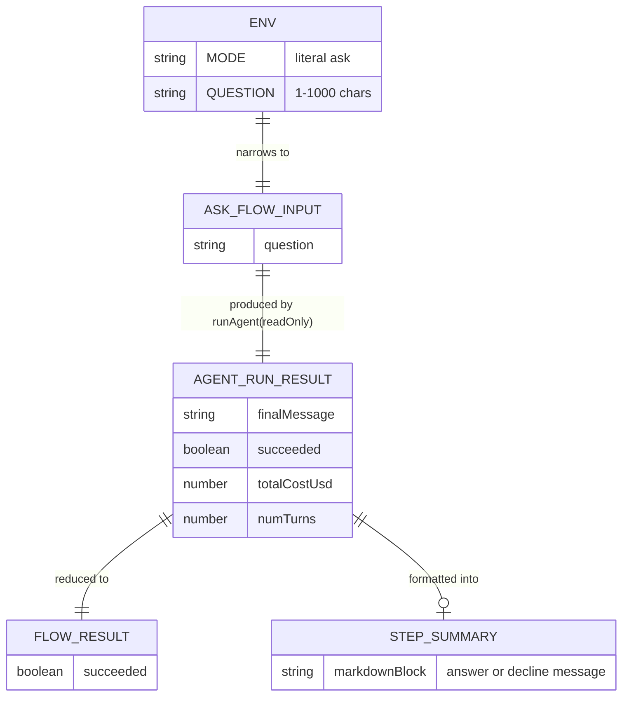
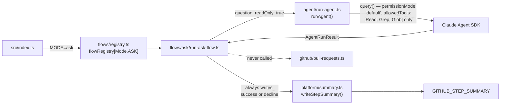

# Plan: Add Ask Mode For Agent

**Spec:** `specs/add-ask-mode-for-agent/spec.md`
**Status:** done

## High-level approach

Add a third mode, `Mode.ASK`, alongside the existing `Mode.RUNNER` and `Mode.REVIEW_FOLLOWUP`.
It is dispatched the same way as `runner` (`workflow_dispatch`), but instead of editing the
target repo and opening a PR, it runs the Claude Agent SDK in a **hard-enforced read-only**
session against `WORKSPACE_PATH`, answers a `QUESTION` about that repo, and writes the answer
(Markdown, with `file_path:line_number` citations) to `GITHUB_STEP_SUMMARY`. If the question isn't
related to the target repo, the run still succeeds and the summary says so — there is no failure
path for "off-topic," only for infrastructure/env problems.

The read-only guarantee is enforced in Szumrak's own code, not deferred to the target repo's
`.claude/agent-config.json` — a target repo's `permissions.allow` must never be able to widen ask
mode's tool access, since that file is repo-owned config, not a security boundary Szumrak should
trust for this guarantee (see Risks). Everything else — the `Mode` enum pattern, the
`Record<Mode, ...>` registry, the env-schema discriminated union, `FlowResult` — is reused exactly
as the two existing modes use it, so a missing `flowRegistry[Mode.ASK]` entry stays a compile
error, consistent with the project's existing invariant.

## Data model

No database. The "data model" here is the shape of data flowing through the new mode — env input,
in-memory flow contracts, and the summary output:

## Component diagram

## API surface

Szumrak has no HTTP API — its "surface" is env-var input and CI-artifact/step-summary output.

| Interface | Direction | Shape | Notes |
|-----------|-----------|-------|-------|
| `MODE=ask` | input (env) | `z.literal(Mode.ASK)` | selects this flow via the discriminated union in `platform/env.ts` |
| `QUESTION` | input (env) | `z.string().min(1).max(1000)` | required only when `MODE=ask`; unrelated to `TASK` |
| `TASK` (if set) | input (env) | ignored | per FR9 — no validation coupling to `MODE=ask` |
| `GITHUB_STEP_SUMMARY` | output (file/CI) | Markdown block | answer or decline message, written via `writeStepSummary` |
| exit code | output (process) | `0` \| `1` | `1` only on infra/env failure, never on "off-topic" (AC2) |

## File-by-file change list

- `src/types/mode.ts` — add `ASK: "ask"` to the `Mode` const enum (currently 6 lines: `RUNNER`, `REVIEW_FOLLOWUP`).
- `src/platform/env.ts`:
  - Add `Mode.ASK` to the `MODE` enum list used by the flat `server` schema.
  - Add `QUESTION: z.string().min(1).max(1000).optional().describe(...)` to the `server` block.
  - Add a new `AskModeEnv = z.object({ MODE: z.literal(Mode.ASK), QUESTION: z.string().min(1).max(1000) })`.
  - Destructure `QUESTION` out into `common` alongside `TASK`/`PR_NUMBER`/`REVIEW_FEEDBACK`, and add `AskModeEnv` to the `discriminatedUnion("MODE", [...])` array in `createFinalSchema`.
  - Set `process.env.MODE` default logic (currently defaults to `Mode.RUNNER` when unset) stays unchanged — `MODE=ask` is always explicit.
- `src/flows/types.ts` — no change (`FlowResult { succeeded: boolean }` is reused as-is).
- `src/flows/registry.ts`:
  - Add `AskFlowInput` (imported from the new flow file) to `FlowInputByMode`.
  - Add `[Mode.ASK]: runAskFlow` to the `flowRegistry` object.
- `src/flows/ask/run-ask-flow.ts` — **new**. Exports `AskFlowInput { question: string }` and `runAskFlow(input: AskFlowInput): Promise<FlowResult>`. Shape: call `runAgent(question, { readOnly: true })` (see `agent/run-agent.ts` change below) → on failure, `log(...)`, `writeStepSummary(...)`, return `{ succeeded: false }` → on success, format the answer (or decline message) as Markdown — wrapped in a collapsible `

Answer
...
` block when it exceeds a reasonable inline length (e.g. beyond a handful of lines) — and call `writeStepSummary(formatted, "✅")`, return `{ succeeded: true }`. No dedup check, no verify gate, no PR/branch/commit call — the shortest of the three flows.
- `src/flows/ask/run-ask-flow.test.ts` — **new**, mirroring `flows/runner/run-runner-flow.test.ts`'s mocking shape (`vi.mock("~/agent/run-agent")`, `vi.mock("~/platform/summary")`, `vi.mock("~/platform/logger")`), using `agentRunResultBuilder` from `src/test/builders/agent-run-result.builder.ts`.
- `src/agent/run-agent.ts`:
  - Extend `runAgent(task: string)` to `runAgent(task: string, options?: RunAgentOptions)` where `RunAgentOptions = { readOnly?: boolean }`, defaulting to `false` — **zero behavior change for the two existing call sites**, which keep calling `runAgent(task)` unmodified.
  - When `readOnly === true`: skip `loadAgentConfig()`'s `permissions.allow`/`deny` entirely (do not merge or extend it — a target repo's config must not be able to widen this), pass `allowedTools: ["Read", "Grep", "Glob"]` with no `disallowedTools` needed since nothing else is allowed, and set `permissionMode: "default"` (never `"acceptEdits"`). Also swaps the `systemPrompt.append` to `ASK_MODE_INSTRUCTIONS` (see `agent/ask-instructions.ts` below) instead of `COMMIT_METADATA_INSTRUCTIONS` — there's nothing to commit in a read-only session.
- `src/agent/ask-instructions.ts` — **new**. Exports `ASK_MODE_INSTRUCTIONS`, a system-prompt-append string mirroring `commit-metadata.ts`'s `COMMIT_METADATA_INSTRUCTIONS` pattern: instructs the model to (a) decline briefly ("isn't related to this project") when the question isn't about the repo (FR5/AC2), (b) answer in Markdown citing `file_path:line_number` (FR7/AC9), and (c) quote exact source excerpts verbatim on request (FR7/AC4). A prompt-level, not code-enforced, guarantee — consistent with the Risks section's "LLM judgment call" framing below.
- `src/agent/run-agent.test.ts` — extend existing tests (or add cases) covering the `readOnly: true` branch: assert the `query()` call receives `allowedTools: ["Read","Grep","Glob"]` and never `permissionMode: "acceptEdits"`, that `loadAgentConfig()` permissions are not consulted, and that `systemPrompt.append` is `ASK_MODE_INSTRUCTIONS` (not the commit-metadata block).
- `src/agent/agent-config.ts` — no change. Documented in-line (existing invariant comment) that ASK mode intentionally bypasses this file's `permissions.allow`.
- `src/platform/summary.ts` — no change to `writeStepSummary`'s signature/behavior; reused directly (already a generic "one markdown block, custom icon" writer, not failure-only despite its default icon).
- `src/index.ts`:
  - Add `Mode.ASK` branch: `if (env.MODE === Mode.ASK) { const result = await flowRegistry[Mode.ASK]({ question: env.QUESTION }); if (!result.succeeded) process.exit(1); }`.
  - Add `hasQuestion: "QUESTION" in env` to the `run_started` log payload, matching `hasTask`/`hasReviewFeedback`.
- `README.md` — document `MODE=ask`, `QUESTION` (per this project's own constitution rule that README must track behavior changes — see `specs/constitution.md` §4 "Documentation").
- `target-repo-templates/.github/workflows/szumrak.yml` — reverted to its pre-feature shape:
  `run-szumrak`'s `task` input stays `required: true`, no `question` input, no mode-selection
  guard step, `env:`/`docker run -e` lists stay `TASK`-only. A shared job with a mode-selection
  guard step was the original plan but is superseded below by giving `ask` its own dedicated,
  single-purpose workflow instead.
- `target-repo-templates/.github/workflows/szumrak-holmes.yml` — **new**. Mirrors `szumrak.yml`'s
  `run-szumrak` job structure (checkout target repo, Node setup + `npm ci` for self-verify support,
  checkout szumrak, build the image) but single-purpose: `workflow_dispatch` with only a `question`
  input (`required: true`), one job (`run-szumrak-holmes`) that runs the container with
  `MODE=ask`, `QUESTION: ${{ github.event.inputs.question }}`, plus the same
  `ANTHROPIC_API_KEY`/`GH_APP_*`/`REPO`/`AGENT_MODEL` secrets/env as `szumrak.yml` for consistency
  (env.ts's existing REPO/GH_APP_* requirement, unless `DRY_RUN`, is unchanged by this feature — see
  invariants). No mode-selection guard needed since the trigger itself only ever means `MODE=ask`.
  Own `concurrency` group (`szumrak-holmes-${{ github.repository }}`) — separate from
  `szumrak.yml`'s group, since an ask-mode run touches nothing the runner/review-followup jobs
  could conflict with (no branch, no commit, no push) and so has no reason to serialize behind them.

## Reused utilities

- `platform/summary.ts` → `writeStepSummary(message, icon)` — reused unmodified.
- `platform/logger.ts` → `log(...)` — reused unmodified (already redacts secrets, per project invariant).
- `agent/run-agent.ts` → `AgentRunResult` type — reused unmodified as the return shape from the read-only call.
- `flows/types.ts` → `FlowResult` — reused unmodified.
- `src/test/builders/agent-run-result.builder.ts` (`agentRunResultBuilder`, mimicry-js) — reused for the new flow's tests.

No existing read-only-agent or citation-formatting utility exists anywhere in `src/` (confirmed via
a targeted grep) — both are net-new, minimal additions described above.

## Risks & mitigations

- **Risk:** a target repo's `.claude/agent-config.json` sets `permissions.allow` to include
  `Edit`/`Write`/`Bash`, which could silently widen ask mode's tool access if `runAgent`'s
  read-only path merged it in.
  **Mitigation:** the read-only branch in `agent/run-agent.ts` ignores `loadAgentConfig()`'s
  permissions entirely and hardcodes `allowedTools: ["Read", "Grep", "Glob"]` — this is a Szumrak-
  enforced guarantee, not a target-repo-configurable one, consistent with the project's existing
  stance that trust boundaries for CI-run behavior live in Szumrak, not the target repo.

- **Risk:** "is this question related to the repo" is an LLM judgement call, not a deterministic
  check — a cleverly-phrased off-topic question could still get an answer, or vice versa.
  **Mitigation:** accepted as a soft guarantee (system-prompt instruction), covered by AC2's test
  but not provable exhaustively; flagged here rather than silently assumed solid.

- **Risk:** `settingSources: ['project']` still loads the target repo's `CLAUDE.md`/`settings.json`
  hooks even in ask mode (existing invariant, unrelated to this feature) — a hook keyed to a
  matcher outside `Edit|Write|MultiEdit` (e.g. a `PreToolUse` hook on `Read`) could theoretically
  still execute during an ask-mode run.
  **Mitigation:** out of scope for this feature to change (it's a standing, documented invariant);
  note that ask mode does not reduce Szumrak's existing exposure to target-repo hook config, it
  only guarantees Szumrak-side tools stay read-only.

- **Risk:** `GITHUB_STEP_SUMMARY` has a platform-side size cap (~1MB); an extremely long answer
  could theoretically exceed it.
  **Mitigation:** not a realistic concern given `QUESTION`'s 1000-char cap and the existing
  `maxTurns`/`maxDurationMs` guards bounding response effort — no truncation logic planned.

- **Risk:** forgetting to wire `Mode.ASK` into `flowRegistry` breaks the build silently.
  **Mitigation:** none needed — this is exactly what `Record<Mode, ...>`'s typing already prevents
  (compile error on a missing key), per the project's existing invariant.

## Open questions for human review

- none — all prior open questions resolved.
