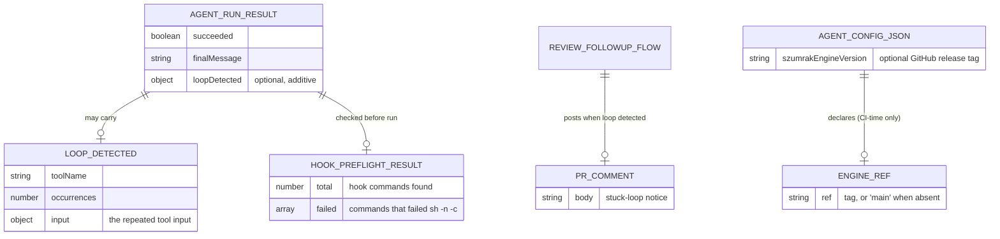

# Plan: Agent Reliability Improvements

**Spec:** `specs/agent-reliability-improvements/spec.md`
**Status:** done

## High-level approach

Three independent hardening mechanisms, each additive to existing behavior with zero change for
the happy path:

1. **Repeated-action loop detection** (S1, FR1-FR3) lives entirely inside `agent/run-agent.ts`'s
   existing `for await (const message of stream)` loop, next to where `tool_use` blocks are
   already turned into `AgentToolCall`s. It tracks the last tool-call signature
   (`name` + stringified `input`) and a repeat counter; on the 3rd consecutive repeat it ends the
   run the same way a normal failure ends today — returning `AgentRunResult` with
   `succeeded: false` — rather than throwing (the existing `MAX_DURATION_MS` guard throws, but
   that path isn't reused here, see Risks). A new optional `loopDetected` field lets
   `review-followup` — the only flow that already has an open PR to talk to — post a comment on it,
   while `runner`/`ask` fall through their existing `!result.succeeded` branches unchanged.

2. **Engine version pinning** (S2, FR4) is a CI-level concern, not a Node-runtime one: the
   `.claude/agent-config.json` field it reads is never parsed by `agent/agent-config.ts` (that
   module's `AgentConfig` type models what the *agent session* consumes; this field is consumed
   entirely by the reference GitHub Actions workflow, before the Szumrak Docker image is even
   built). A new workflow step reads the field with `jq` right after the target repo is checked
   out, defaults to `main` when absent, and feeds it into the existing "Checkout szumrak" step's
   new `ref:` input.

3. **Hook pre-flight check** (S3, FR5-FR6) is a new small module, `agent/hook-preflight.ts`,
   called once at the very top of `runAgent()` — before `query()` is ever invoked — for every mode
   including `readOnly`. It re-creates, on purpose, the exact failure mode diagnosed live on
   2026-07-16 (`craft-flow`'s bash-only hook syntax breaking under `sh -c`): it dry-run-parses
   every hook command in the target repo's `.claude/settings.json` with `sh -n -c "<command>"` —
   which parses without executing, so a hook that legitimately blocks `rm -rf` is never actually
   run here, only checked for syntax. Partial failures log a warning and the run proceeds; total
   failure (every hook fails, and there was at least one) aborts before the SDK is ever called,
   at zero API cost.

## Data model

Not a database feature — this is the shape of the new signals flowing between the agent runtime,
the flows, and GitHub, plus the CI-time engine-ref resolution:

## Component diagram

```mermaid
flowchart LR
    subgraph "GitHub Actions (CI, before container)"
        Checkout["Checkout target repo"] --> ResolveRef["Resolve Szumrak engine ref\n(reads agent-config.json,\nfalls back to main)"]
        ResolveRef --> CheckoutSzumrak["Checkout szumrak\n(ref: resolved tag or main)"]
        CheckoutSzumrak --> BuildImage["Build Szumrak image"]
    end

    subgraph "Node process inside the container"
        RunAgent["agent/run-agent.ts\nrunAgent()"]
        Preflight["agent/hook-preflight.ts\ncheckHookHealth()"]
        RunAgent -->|"1: before query()"| Preflight
        Preflight -->|"all hooks broken"| AbortEarly["return { succeeded: false }\n— query() never called"]
        Preflight -->|"partial/none broken"| SDK["query() stream loop\n(existing)"]
        SDK -->|"same tool + input x3"| LoopGuard["repeat counter\n(new, inline in the loop)"]
        LoopGuard -->|"threshold hit"| Result["AgentRunResult\n{ succeeded: false, loopDetected }"]
        SDK -->|"normal completion"| Result
    end

    BuildImage --> RunAgent
    Result --> RunnerFlow["flows/runner\n(unchanged: !succeeded branch)"]
    Result --> AskFlow["flows/ask\n(unchanged: !succeeded branch)"]
    Result --> ReviewFlow["flows/review-followup\n(NEW: loopDetected branch)"]
    ReviewFlow -->|"loopDetected only"| PostComment["github/pull-requests.ts\npostPrComment() — NEW"]
```

## API surface

Szumrak has no HTTP API; the "surface" here is the new exported functions/fields other modules
will call or read, plus the new CI-time config field:

| Interface | Direction | Shape | Notes |
|-----------|-----------|-------|-------|
| `AgentRunResult.loopDetected` | output (in-process) | `{ toolName: string; occurrences: number; input: Record<string, unknown> }` optional | set only when S1 fires; every existing consumer already handles `succeeded: false` |
| `checkHookHealth(workspacePath)` | function | `(string) => { total: number; failed: Array<{ event: string; command: string }> }` | new, `agent/hook-preflight.ts`; never throws (mirrors `agent-config.ts`'s missing/invalid-file tolerance) |
| `postPrComment(owner, repo, prNumber, body)` | function | `(string, string, number, string) => Promise<void>` | new, `github/pull-requests.ts`; wraps `octokit.issues.createComment` |
| `.claude/agent-config.json`'s new field | input (CI, not Node) | `{ szumrakEngineVersion?: string }` | read only by the workflow YAML via `jq`, before the Docker image is built; **not** added to the TS `AgentConfig` type |
| `SZUMRAK_REF` env var | CI-internal | GitHub release tag string, or `"main"` | resolved by the new workflow step, consumed by "Checkout szumrak"'s new `ref:` input |

## File-by-file change list

- `src/agent/run-agent.ts`:
  - Add `REPEATED_ACTION_LIMIT = 3` constant.
  - Track `lastToolSignature`/`repeatCount` (reset per run) alongside the existing `toolCalls`
    accumulator; update inside the `block.type === "tool_use"` branch (currently lines 128-132),
    next to the existing `log("tool_call", toolCall)` call.
  - On the 3rd consecutive repeat: `log("repeated_action_loop_detected", { toolName, input, occurrences })`,
    end stream consumption (see Risks re: cleanly stopping the SDK's async generator), set
    `succeeded = false`, `finalMessage` to a human-readable diagnostic, populate the new
    `loopDetected` field — then fall through to the function's existing single `return` statement
    (line 214) so `commitMetadata`/`agent_end` logging stay untouched.
  - Call `checkHookHealth(env.WORKSPACE_PATH)` at the very top of `runAgent()`, before building the
    `query()` options object (before current line 65). Branch:
    - `total > 0 && failed.length === total` → log, return `{ succeeded: false, ...,  }` immediately,
      never call `query()`.
    - otherwise (including `total === 0`) → log a warning only if `failed.length > 0`, proceed
      exactly as today.
  - `AgentRunResult` gains `loopDetected?: { toolName: string; input: Record<string, unknown>; occurrences: number }`.
    Both new early-return paths (loop detected, all hooks broken) must still populate every
    existing field the type declares (`toolCalls`, `finalMessage`, etc. — not `undefined`/missing)
    so existing consumers that destructure the full shape don't break.
- `src/agent/hook-preflight.ts` — **new**. Exports `checkHookHealth(workspacePath: string): HookHealthReport`
  where `HookHealthReport = { total: number; failed: Array<{ event: string; command: string }> }`.
  Reads `<workspacePath>/.claude/settings.json` with the same existsSync/readFileSync/try-catch
  tolerance as `agent-config.ts`'s `readJson` (missing or invalid file ⇒ `{ total: 0, failed: [] }`,
  never throws). Walks every `hooks.<Event>[].hooks[].command` string found and dry-run-checks each
  with `execFileSync("/bin/sh", ["-n", "-c", command])` in a try/catch.
- `src/agent/hook-preflight.test.ts` — **new**. Unit tests: no settings.json file → `{0, []}`;
  all-valid hooks → `{N, []}`; one broken hook among several → `{N, [thatOne]}`; every hook broken
  → `{N, all N}`. Mirrors `agent-config.test.ts`'s fs-mocking shape.
- `src/agent/run-agent.test.ts` — extend: (a) feed `streamOf([...])` 3 identical
  `assistantMessage([{type:"tool_use", name, input}])` messages in a row, assert the run ends with
  `succeeded: false` and `result.loopDetected` populated, and that `query()`'s stream isn't
  consumed further after the 3rd repeat; (b) a case with only 2 repeats does NOT trigger it;
  (c) mock `checkHookHealth` (new `vi.mock("~/agent/hook-preflight")`) to return "all failed" and
  assert `query()` is never called; (d) a case with a partial hook failure still calls `query()`.
- `src/github/pull-requests.ts` — add `postPrComment(owner: string, repo: string, prNumber: number, body: string): Promise<void>`,
  calling `octokit.issues.createComment({ owner, repo, issue_number: prNumber, body })`, matching
  this file's existing plain-object Octokit call convention.
- `src/github/pull-requests.test.ts` — extend with a test asserting `postPrComment` calls
  `octokit.issues.createComment` with the right `issue_number`/`body`.
- `src/flows/review-followup/run-review-followup-flow.ts` — inside the existing
  `if (!result.succeeded) { ... }` block (currently lines 89-95), add: `if (result.loopDetected) { await postPrComment(owner, repo, prNumber, <stuck-loop message>); }`
  before the existing `log`/`writeStepSummary`/`return { succeeded: false }`.
- `src/flows/review-followup/run-review-followup-flow.test.ts` — extend: given
  `agentRunResultBuilder.one({ traits: "failed", overrides: { loopDetected: {...} } })`, assert
  `mockedOctokit.issues.createComment` (or a mocked `postPrComment`, depending on which mock
  boundary the test file already uses for `~/github/pull-requests`) is called with a message
  naming the stuck tool; given a plain failure with no `loopDetected`, assert it is NOT called.
- `target-repo-templates/.github/workflows/szumrak-worker.yml` — in **both** jobs (`work`,
  `review-followup`), add a new step "Resolve Szumrak engine ref" right after "Checkout target
  repo" and before "Checkout szumrak": reads `workspace/.claude/agent-config.json`'s
  `szumrakEngineVersion` field with `jq` (preinstalled on `ubuntu-latest`), defaulting to `main`
  when the file or field is absent, exports it via `$GITHUB_ENV` as `SZUMRAK_REF`. "Checkout
  szumrak" gains `ref: ${{ env.SZUMRAK_REF }}`. Update the file's top-of-file comment (currently
  says "Checkout szumrak" always points at `JanSzewczyk/szumrak` — still true for the
  *repository*, but no longer implies always `main`).
- `target-repo-templates/.github/workflows/szumrak-holmes.yml` — same "Resolve Szumrak engine ref"
  step and `ref:` addition to its single job's "Checkout szumrak" step, for consistency (it has an
  identical checkout step; leaving it unpinned while `szumrak-worker.yml` is pinned would be an
  inconsistency between the two templates).
- `target-repo-templates/.claude/agent-config.json` — no schema change to the file itself (it's a
  living example, not a schema definition), but add a short comment *elsewhere* (README) since
  JSON has no comment syntax — see below.
- `README.md` — document `szumrakEngineVersion` in the "Target Repo Configuration" section
  (purpose, default-to-`main` behavior, that it must be a real release tag of
  `JanSzewczyk/szumrak`) and mention the new hook pre-flight check + repeated-action guard in the
  "Flows" or a new short "Reliability" section.
- `CLAUDE.md` — add a short invariant note: `agent/hook-preflight.ts`'s dry-run check
  (`sh -n -c`) never executes hook commands, only parses them — this must never be changed to an
  actual execution, or it would reintroduce exactly the risk it's meant to catch (running an
  untrusted/broken command for real).

## Reused utilities

- `platform/logger.ts` → `log(event, data)` — reused unmodified for every new diagnostic
  (`repeated_action_loop_detected`, `hook_preflight_warning`, `hook_preflight_all_failed`); secret
  redaction and truncation apply automatically to whatever payload is passed.
- `agent/agent-config.ts`'s `readJson`-style existsSync/readFileSync/try-catch pattern — mirrored
  (not imported, since `hook-preflight.ts` reads a different file) in the new hook-preflight
  module for consistent missing/invalid-file tolerance.
- `github/client.ts` → `octokit` — reused unmodified; `postPrComment` is a thin new wrapper in the
  same file (`pull-requests.ts`) as the existing `commitAndOpenPR`, following its call-shape
  convention exactly.
- `test/builders/agent-run-result.builder.ts` (`agentRunResultBuilder`) — reused for the new
  `loopDetected`-carrying test fixtures via its existing `overrides`/`traits` API.

No existing loop-detection, hook-syntax-checking, or PR-comment-posting utility exists anywhere in
`src/` today (confirmed via a targeted repo survey) — all three are net-new, minimal additions
described above.

## Risks & mitigations

- **Risk:** stopping mid-stream consumption (S1) might not cleanly terminate the underlying Claude
  Agent SDK subprocess if the SDK expects the `for await` loop to run to natural completion (a
  `result` message) before releasing resources.
  **Mitigation:** per this project's own standing invariant ("SDK typings are ground truth, not
  the online docs"), check `node_modules/@anthropic-ai/claude-agent-sdk/sdk.d.ts` for an explicit
  cancellation/abort method on the `Query` object before relying on a bare `break`; if none exists,
  breaking the loop is still safe for a CI container that's about to be torn down anyway
  (`docker run --rm`), but this should be verified, not assumed, during `/sdd:tasks`/`/sdd:implement`.

- **Risk:** the existing `MAX_DURATION_MS` guard *throws* an `Error` (bypassing the normal
  `AgentRunResult` return and, further up, being caught only by `index.ts`'s generic
  `fatal_error` handler) — a different termination shape than the one this feature introduces
  for repeated-action detection (a normal `{ succeeded: false, loopDetected }` return). This
  asymmetry is deliberate (see High-level approach) so `review-followup` can distinguish "stuck
  in a loop, post a PR comment" from "ran out of time, nothing more to say" — but it means the two
  guards behave differently and a future reader could reasonably ask why. **Mitigation:** document
  the distinction inline in `run-agent.ts` next to both guards; do not unify them in this feature
  (out of scope — `MAX_DURATION_MS`'s throw-based behavior is pre-existing and untouched).

- **Risk:** `sh -n -c "<command>"` (S3) only catches *syntax* errors (unbalanced brackets, bad
  quoting) — the exact class of bug diagnosed on 2026-07-16 — not semantic ones (a command that
  parses fine but references a tool that isn't installed, or a `$VAR` that's never set). A hook
  can still fail for other reasons this check won't catch.
  **Mitigation:** explicitly scoped as a syntax-only pre-flight in FR5's wording ("syntactically
  executable") — not a general hook-correctness guarantee. Worth a one-line callout in the
  README so it isn't mistaken for a broader guarantee.

- **Risk:** `sh -n` behavior can differ subtly across shells (`dash` vs `bash` vs `busybox sh`) —
  the check must run under the *same* `/bin/sh` the target repo's hooks actually execute under
  inside the Szumrak Docker image, not the host machine's shell, or it could pass/fail
  inconsistently with reality.
  **Mitigation:** this code always runs inside the same Docker container as the agent session
  (the Node process *is* the container), so `/bin/sh` is guaranteed to be the same binary either
  way — no cross-environment mismatch is possible by construction.

- **Risk:** `jq` availability on `ubuntu-latest` runners (S2) — if GitHub ever changes the default
  image and drops `jq`, the ref-resolution step silently breaks.
  **Mitigation:** `jq` has shipped on `ubuntu-latest` for years and is explicitly documented by
  GitHub as pre-installed; low risk, but the step should default to `main` on any `jq` failure
  (`|| echo main`) rather than failing the whole job, so a missing/changed tool degrades to
  today's behavior instead of blocking every run.

- **Risk:** S2 only changes the *reference templates* in this repo (`target-repo-templates/`) —
  the already-installed copy in `craft-flow` (and any other real target repo) will not pick up
  `szumrakEngineVersion` support until someone manually copies the updated workflow files there,
  exactly as happened for every other template change this session (actor-guard, `next typegen`,
  the `szumrak-worker.yml` rename). This is consistent with the "template propagation" story being
  explicitly dropped from this feature's scope (see spec Non-goals) — flagged here so it isn't
  mistaken for an oversight.
  **Mitigation:** none needed within this feature; call out in the PR description that
  `craft-flow` needs the same manual copy step as always, same as every prior template change.

## Open questions for human review

- none — spec.md's open questions were fully resolved during `/sdd:clarify`.
