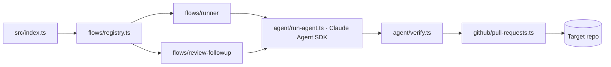

# Project Constitution

> **The source of truth for this project's rules of engagement.**
> The SDD framework reads this file for operational context and edits it via `/sdd:constitution`.
>
> Edit this file with `/sdd:constitution`. No token limit — be detailed.
> Every "WHAT NOT TO DO" entry should carry a *reason* (the incident, the trade-off, the
> upstream constraint). Without rationale, rules become folklore that future contributors
> mechanically break.

**Last reviewed:** 2026-07-16
**Owners:** JanSzewczyk

---

## 1. Tech stack

- **Runtime:** Node.js >= 24, TypeScript run directly via `tsx` (no compile step, no `dist/`)
- **Framework:** none (CLI/engine) — wraps the Claude Agent SDK (`@anthropic-ai/claude-agent-sdk`) and Octokit (`@octokit/rest`, `@octokit/auth-app`)
- **Database:** none
- **Tests:** Vitest (`src/**/*.test.ts`), `SKIP_ENV_VALIDATION=true` set in `vitest.config.ts`
- **Lint / format:** Biome (`biome check .`)
- **Other notable libs:** Zod + `@t3-oss/env-core` for env validation, `mimicry-js`/`@faker-js/faker` for test data, `semantic-release` for releases

**Why this stack:** Szumrak is the engine of an autonomous agent that runs the Claude Agent SDK
against a separate target repository, lets the model make edits, then commits/pushes and opens a
labelled PR. It never operates on itself — `src/` is the engine, `target-repo-templates/` are files
meant to be copied into the target repo. Deployment is "Option A": Szumrak stays a separate repo and
is built locally from source (`docker build`) inside the target repo's CI, rather than published as
an image — hence no compile step for the engine itself (tsx directly, `tsc` is typecheck-only).

**Links:**
- Design source of truth: Notion workspace "Szumrak — Autonomiczny Agent dla Repozytoriów" (pages in Polish; page 17 is the rollout plan)
- Root `CLAUDE.md` (this repo) — architecture, execution flow, and invariants in detail

---

## 2. Run/build commands

| Command | Purpose |
|---------|---------|
| `npm start` | run the agent (`tsx src/index.ts`, no compile step) |
| `npm run build` | `docker build -t szumrak -f docker/Dockerfile .` — the CI "build" check (this repo's only build artifact) |
| `npm test` | `vitest run` — unit tests for `src/**/*.test.ts` |
| `npm run typecheck` | `tsc --noEmit` (tsconfig is noEmit; Bundler resolution, extensionless imports) |
| `npm run biome:check` | Biome lint + format check (`biome:fix` to autofix) |
| `npm run dev:run` | `docker run` against `$TARGET_REPO_PATH` mounted at `/workspace` (`DRY_RUN` on) — local only |

Verification for a change: `npm run typecheck && npm test && npm run biome:check`.

Running the agent locally (fastest loop):
```bash
WORKSPACE_PATH=/path/to/target-repo TASK="..." DRY_RUN=true ANTHROPIC_API_KEY=sk-ant-... npm start
```

---

## 3. Architecture

Szumrak is the **engine** of an autonomous agent. It runs the Claude Agent SDK against a
**separate target repository** (mounted at `WORKSPACE_PATH`, default `/workspace`), lets the model
make edits, then commits/pushes and opens a labelled PR — unless `DRY_RUN=true`, which leaves
changes on disk only. This repo never operates on itself.



`src/` is organized by concern:
- **`src/types/`** — shared types/enums (e.g. `types/mode.ts`'s `Mode` const enum).
- **`src/flows/`** — one folder per orchestration flow, dispatched via `flows/registry.ts`'s
  `Record<Mode, ...>`.
- **`src/agent/`** and **`src/github/`** — reusable building blocks (Claude Agent SDK wrapper,
  git/GitHub integration).
- **`src/platform/`** — cross-cutting infra: env validation, JSONL logging, CI step summaries.

**Boundaries we maintain:**
- The engine (`src/`) never edits itself as a "target" — it only acts on `WORKSPACE_PATH`.
- `target-repo-templates/` are files meant to be copied *into* the target repo, never consumed here.
- All git/PR work happens in Node after the agent run (`github/`) — the agent itself never runs git.

---

## 4. Code conventions

- TypeScript strict; no `dist/`, no compile step — run via `tsx`.
- `module: "ESNext"` + `moduleResolution: "Bundler"`; **no `.js` import extensions** (Biome strips
  them from relative imports — reintroducing NodeNext/`.js` extensions fights Biome and breaks the build).
- Conventional Commits (`feat`, `fix`, `chore`, `refactor`, `docs`, `test`), enforced both for this
  repo's own history and for commits the agent makes on target repos (`agent/commit-metadata.ts`).
- Every env var read through `env` from `platform/env.ts` — never `process.env.X` directly in
  application code (exceptions: `vitest.config.ts` and `*.test.ts` files).
- `Mode` (`types/mode.ts`) is the single source of truth for the `MODE` value — never compare
  `env.MODE` against a raw string literal.

**Clean code:**
- Keep functions and modules small and single-purpose; a file that does two unrelated things
  should be split along `src/`'s existing concern boundaries (`types/`, `flows/`, `agent/`,
  `github/`, `platform/`), not grown in place.
- No dead code: delete unused exports, functions, types, and commented-out blocks rather than
  leaving them "in case." If it's not called, it doesn't stay.
- Prefer clear naming and small, composable helpers over clever one-liners — this is an engine
  meant to be read and extended, not a script optimized for brevity.
- Avoid duplication: if the same logic appears in two flows or two modules, extract it into the
  shared layer it belongs to (`agent/`, `github/`, or `platform/`) rather than copy-pasting.

**Maintaining and improving structure:**
- Treat the `src/` organization (types → flows → agent/github → platform) as a standing
  responsibility, not a one-time decision. When adding a feature, place new code in the
  concern it belongs to; when a change makes an existing file or boundary awkward, take the
  opportunity to restructure rather than bolting on an exception.
- Continuously look for opportunities to simplify: collapse redundant abstractions, tighten
  overly generic types, and remove indirection that no longer earns its keep as the codebase
  evolves.
- Every non-trivial change should leave the project structure at least as clean as it was found
  — this is an ongoing practice, not a one-off cleanup pass.

**Documentation:**
- `README.md` is this project's living documentation — the first thing a new contributor or an
  agent reads to understand what Szumrak is, how to run it, and how it's configured.
- Update `README.md` whenever a change alters what it currently documents: new/changed/removed
  env vars, new commands or scripts, a changed execution flow, a new flow/mode, or any behavior
  change visible to someone running or configuring the agent. Treat a stale README as a bug in
  the change, not a follow-up task.

**Examples** (good vs. bad):

```ts
// ✅ Good
import { env } from "~/platform/env";
if (env.MODE === Mode.RUNNER) { ... }

// ❌ Bad
if (process.env.MODE === "runner") { ... }
```

---

## 5. WHAT NOT TO DO ⛔

> ### DO NOT use `execSync` with an interpolated string in `github/git-operations.ts`
>
> **Why:** `TASK` is untrusted input (in CI it comes from a GitHub comment body); string
> interpolation into a shell command is a command-injection vector. Use `execFileSync` with an
> argument array instead — this is already how the file is written; keep it that way.

> ### DO NOT reintroduce a Szumrak-side SDK `hooks` option on `query()`
>
> **Why:** there used to be a programmatic Stop hook that re-ran `verify` mid-session; it was
> removed by design so the agent uses the *target repo's own* `settings.json` hooks (loaded via
> `settingSources: ['project']`) instead of a parallel Szumrak-side mechanism. `agent/verify.ts`
> still runs, but only once, as the runner flow's post-run gate.

> ### DO NOT add `'user'`/`'local'` to `settingSources`
>
> **Why:** `settingSources: ['project']` — and only `'project'` — is what makes the SDK discover
> the target repo's `.claude/skills/`, load its `CLAUDE.md`, and load its `settings.json` hooks. A
> developer's machine-local settings (`'user'`/`'local'`) must never steer an unattended CI run.

> ### DO NOT bypass `platform/logger.ts`'s `log()` with a raw `console.log`/`appendFileSync`
>
> **Why:** `agent-run.jsonl` is uploaded as a CI artifact readable by anyone with repo/Actions
> access. `log()` runs `sanitizeValue()` (redacts `sk-ant-`, `AKIA`, `ghp_`/`github_pat_`,
> Google/Slack keys, PEM blocks; truncates long strings) on every logged value before it's written
> — skipping it risks leaking a hardcoded key the agent read mid-run into a public-ish artifact.

> ### DO NOT add Szumrak-side skill definitions
>
> **Why:** skills are target-repo opt-in only. The SDK `skills` option is passed through verbatim
> from the target repo's `agent-config.json`; skill content lives in the target repo's
> `.claude/skills/`, never in this repo.

> ### DO NOT add AI/Claude attribution to git commits in this repo
>
> **Why:** user's global instruction — commits in every repository are made in the user's name
> with a clean message, no `Co-Authored-By` trailer or "Generated with Claude Code" line.

> ### DO NOT merge a change that alters behavior without updating `README.md`
>
> **Why:** `README.md` is this project's documentation of record — env vars, commands, and the
> execution flow described there are what a new contributor (human or agent) trusts first. A
> code change that silently outpaces it turns the README into a source of misleading
> instructions instead of a source of truth.

---

## 6. Testing philosophy

- **Test-first (default)** — write the failing test first, then the implementation.
- **Contract-first (exception)** — for typed contracts other code references by shape (rare in
  this engine; mostly applies to `flows/types.ts`-style shared contracts).
- Tests live alongside source as `src/**/*.test.ts`, run via `npm test` (Vitest).
- **What we DO NOT test:** the Docker build itself (covered by `npm run build`/CI, not Vitest);
  `target-repo-templates/` content (consumed by target repos, not this repo's runtime).

---

## 7. Error handling philosophy

- `platform/env.ts` fails fast: invalid config prints a readable list and `process.exit(1)` before
  the agent runs, so a bad env never wastes an API turn.
- A missing or invalid `.claude/agent-config.json` in the target repo is not an error — it just
  means "no extra restriction beyond `acceptEdits`, no skills, no verify."
- `agent/verify.ts` aggregates every failing verify command into one report rather than
  failing fast on the first — the runner flow's post-run gate needs the full picture.
- Failures surface via `writeStepSummary` (`GITHUB_STEP_SUMMARY`) on the target repo's job summary
  page — no PR/issue comment posting mechanism today.

---

## 8. Out of scope (what we explicitly DO NOT do)

- Szumrak does not operate on its own source as a "target" — that's a different repo's job.
- No SDK-level hooks owned by Szumrak (see WHAT NOT TO DO above) — quality control during a run
  is entirely the target repo's own tooling.
- No `'user'`/`'local'` setting sources — no developer-machine-local steering of CI runs.

---

## 9. SDD flow reminder

- Start any feature with `/sdd:doctor check`.
- Per feature: `/sdd:spec` → `/sdd:clarify` → `/sdd:plan` → `/sdd:tasks` → `/sdd:implement <id>` → `/sdd:review`.
- Specs live in `specs/<feature-slug>/`; the constitution lives at `specs/constitution.md`.
- Routing rules + installed capabilities: `specs/capabilities.md`.
